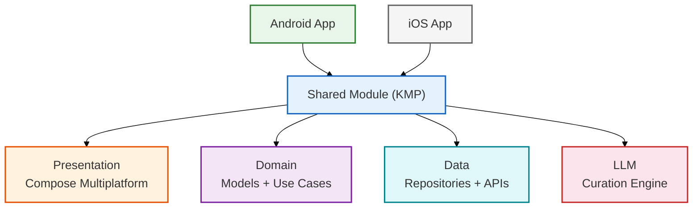
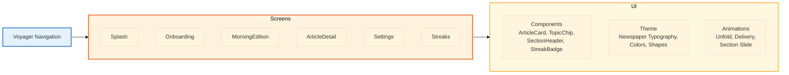
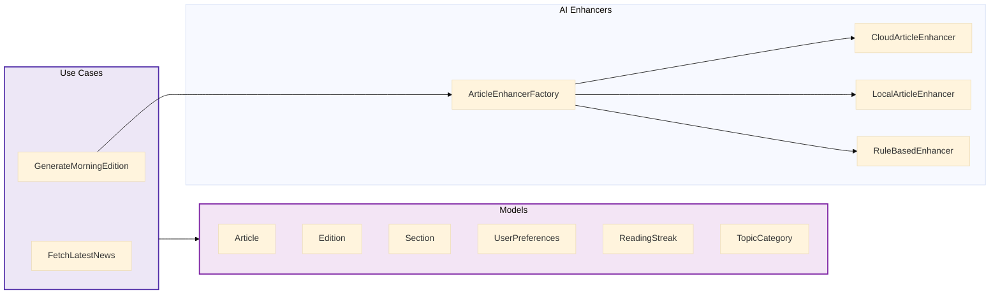
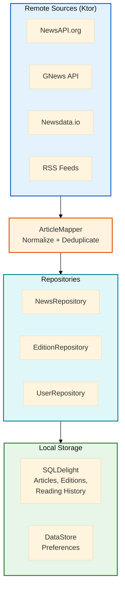
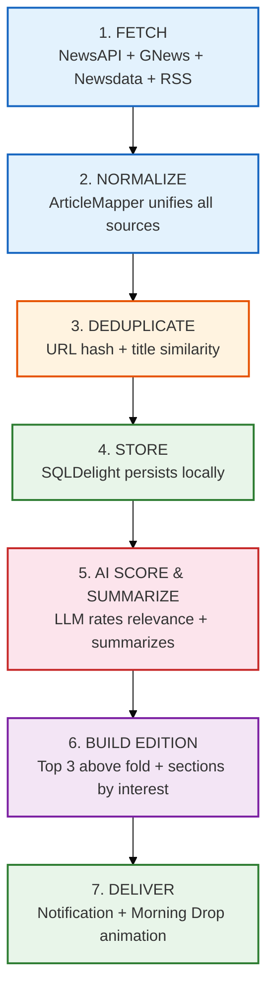
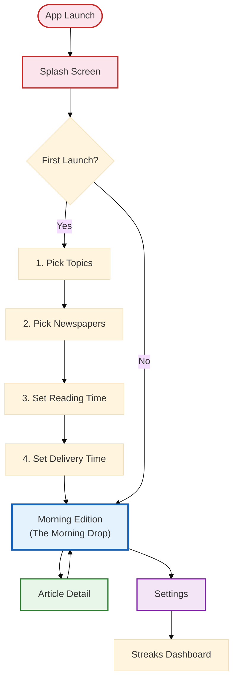
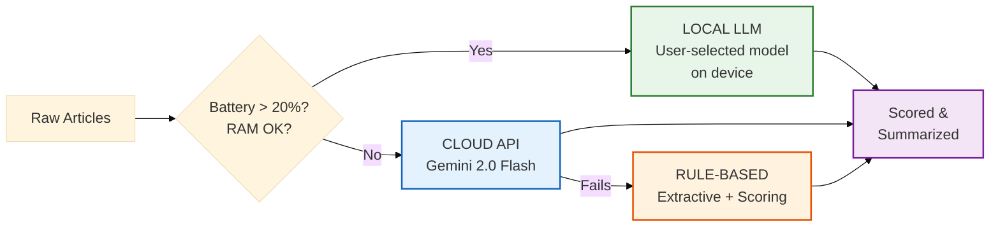
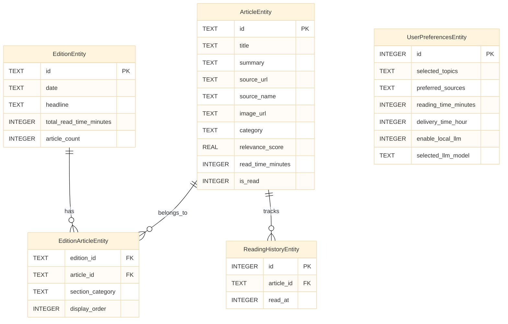
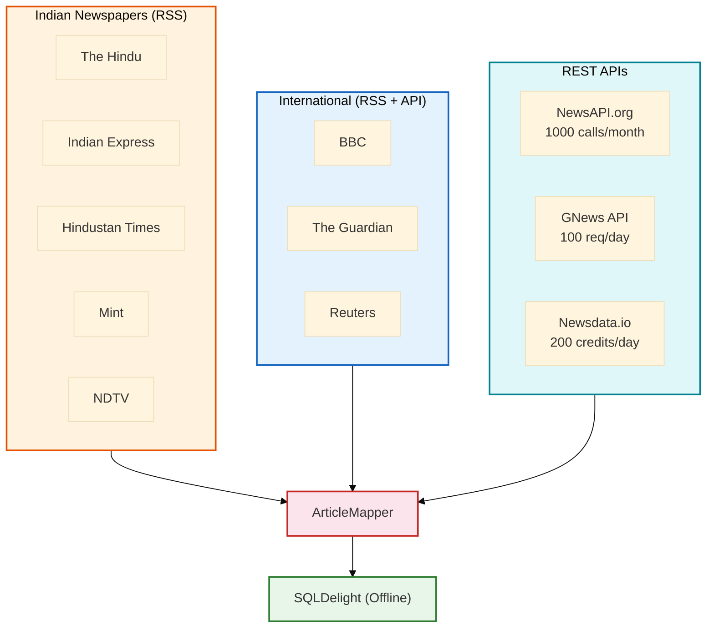
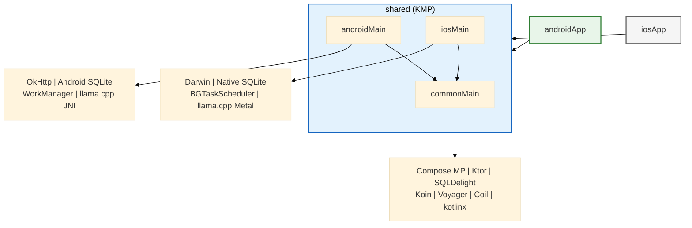

# Paperwala - Architecture Documentation

> A curated morning news briefing app inspired by the Indian newspaper wala.
> Built with **Kotlin Multiplatform (KMP) + Compose Multiplatform**.

---

## 1. High-Level Architecture



---

## 2. Presentation Layer



---

## 3. Domain Layer



---

## 4. Data Layer



---

## 5. Daily Edition Pipeline



---

## 6. Screen Navigation Flow



---

## 7. LLM Fallback Chain



### Available On-Device Models

Users can choose from 4 GGUF-quantized (Q4_K_M) models in Settings:

| Model | Size | Speed | Quality | RAM Required |
| --- | --- | --- | --- | --- |
| **Phi-3-mini** (default) | 2.3 GB | ~8 tok/s | Best quality | 3.5 GB |
| **Llama 3.2 3B** | 1.9 GB | ~12 tok/s | Fast + good | 3.0 GB |
| **Llama 3.2 1B** | 0.8 GB | ~30 tok/s | Fastest, basic | 1.5 GB |
| **Gemma 2 2B** | 1.5 GB | ~16 tok/s | Balanced | 2.5 GB |

The `LlmModel` enum in `domain/ai/LlmModel.kt` defines download URLs, file names, sizes, and RAM requirements. Selection is persisted in `UserPreferences` (SQLite `selected_llm_model` column).

---

## 8. Database Schema



---

## 9. News Sources



---

## 10. Module Dependencies



---

## 11. "The Morning Drop" UI Layout

```
    ╔══════════════════════════════════╗
    ║         P A P E R W A L A        ║
    ║        Sunday, Feb 22, 2026      ║
    ╚══════════════════════════════════╝

    Good Morning, Randhir
    ~10 min read  |  12 stories

    ━━━━━━━━  ABOVE THE FOLD  ━━━━━━━━

    ┌──────────────────────────────────┐
    │          [HERO IMAGE]            │
    │                                  │
    │   Budget 2026: Major Tax         │
    │   Reforms Announced              │
    │                                  │
    │   The Union Budget 2026          │
    │   introduces significant         │
    │   income tax reforms...          │
    │                                  │
    │   THE HINDU  ·  3 min read       │
    └──────────────────────────────────┘

    ┌───────────────┐  ┌───────────────┐
    │   [image]     │  │   [image]     │
    │  Story #2     │  │  Story #3     │
    │  Summary...   │  │  Summary...   │
    │  HT · 2 min   │  │  BBC · 4 min  │
    └───────────────┘  └───────────────┘

    ━━━━━━━━  TECHNOLOGY  ━━━━━━━━━━━━

    ┌────────┐  ┌────────┐  ┌────────┐
    │ Card 1 │  │ Card 2 │  │ Card 3 │
    └────────┘  └────────┘  └────────┘
                                → scroll

    ━━━━━━━━  BUSINESS  ━━━━━━━━━━━━━━

    ┌────────┐  ┌────────┐
    │ Card 1 │  │ Card 2 │
    └────────┘  └────────┘

    ━━━━━━━━  SPORTS  ━━━━━━━━━━━━━━━━

    ┌────────┐  ┌────────┐  ┌────────┐
    │ Card 1 │  │ Card 2 │  │ Card 3 │
    └────────┘  └────────┘  └────────┘

    ══════════════════════════════════
    End of today's edition
    12 stories  ·  10 min read
```

Each section **unfolds with a 3D animation** (`graphicsLayer { rotationX }` with `spring(dampingRatio=0.65)`) as the user scrolls it into view — like unfolding a real newspaper.

---

## 12. Technology Stack

| Category | Technology | Version |
| --- | --- | --- |
| **Language** | Kotlin | 2.1.10 |
| **Framework** | Kotlin Multiplatform | - |
| **UI** | Compose Multiplatform | 1.7.3 |
| **Platforms** | Android (26+), iOS (15+) | - |
| **HTTP** | Ktor | 3.1.0 |
| **JSON** | kotlinx.serialization | 1.7.3 |
| **RSS/XML** | KSoup | 0.4.0 |
| **Images** | Coil 3 (KMP) | 3.1.0 |
| **Database** | SQLDelight | 2.0.2 |
| **Preferences** | DataStore | 1.1.3 |
| **DI** | Koin | 4.0.2 |
| **Navigation** | Voyager | 1.1.0-beta03 |
| **Async** | kotlinx.coroutines | 1.9.0 |
| **Date/Time** | kotlinx.datetime | 0.6.1 |
| **Local LLM** | llama.cpp bindings | - |
| **LLM Models** | Phi-3-mini, Llama 3.2, Gemma 2 (Q4_K_M GGUF) | 0.8-2.3 GB |
| **Cloud API** | Gemini 2.0 Flash (free tier) | - |
| **Animations** | Compose Animation | - |
| **Lottie** | Compottie | 2.0.0-rc01 |
| **Fonts** | Playfair Display, Lora, JetBrains Mono | - |
